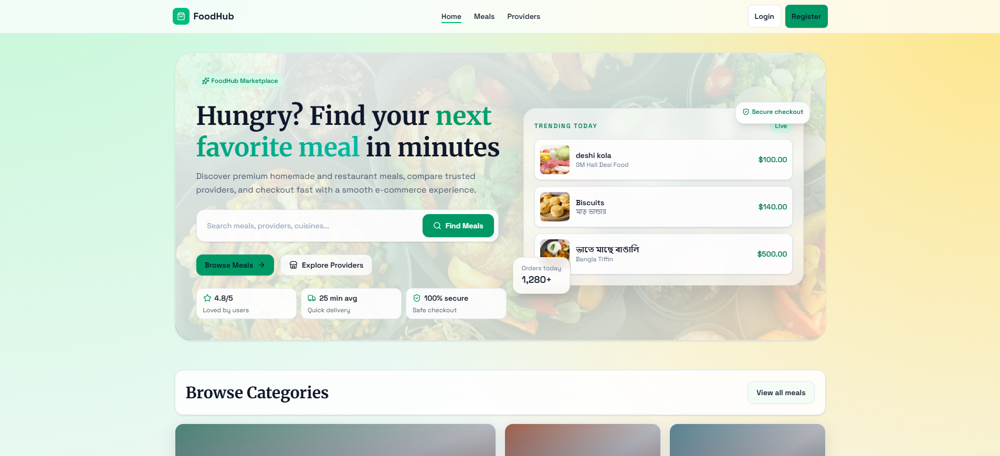
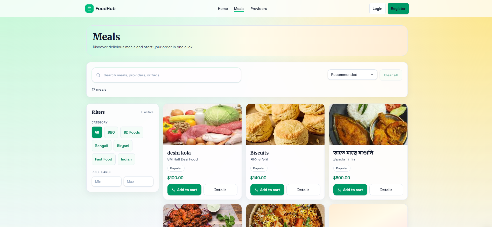
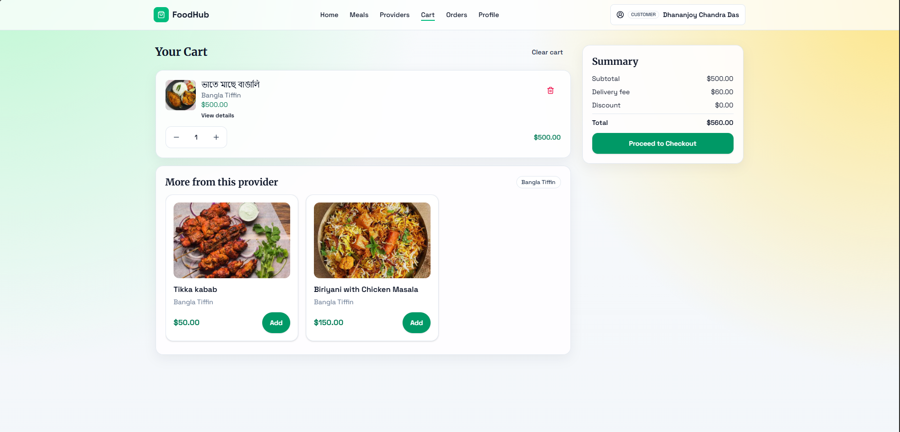
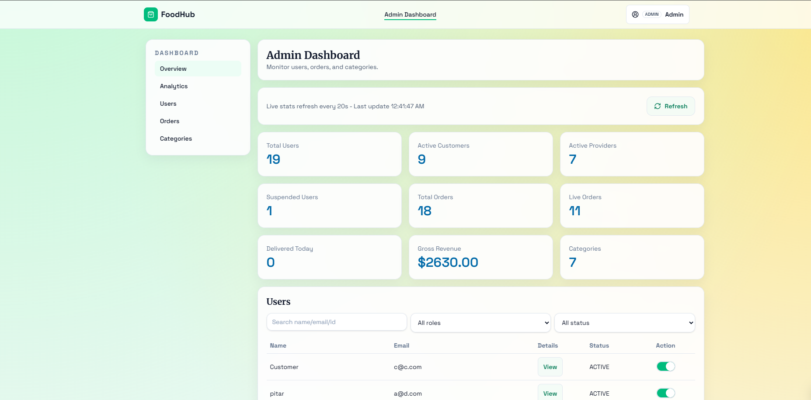

# FoodHub

**Production-ready full-stack meal ordering platform focused on performance, scalability, and conversion-driven UX.**

## Live Demo

- Frontend (Web App): [FoodHub Live](https://foodhub.app)
- Backend (API): [FoodHub API](https://foodhub-server-api-sigma.vercel.app/)

## Screenshots

| Home Page                                      | Meals Listing                                       |
| ---------------------------------------------- | --------------------------------------------------- |
|  |  |

| Checkout Flow                                          | Dashboard                                           |
| ------------------------------------------------------ | --------------------------------------------------- |
|  |  |

## Tech Stack

### Frontend

- Next.js (App Router)
- React + TypeScript
- Tailwind CSS
- ShadCN UI
- TanStack Query
- TanStack Form

### Backend

- Node.js
- Express.js
- Prisma ORM

### Database

- PostgreSQL

### Deployment

- Frontend: Vercel
- Backend: Render / other Node-compatible cloud platform

## Key Features

- Role-based authentication and authorization for `Customer`, `Provider`, and `Admin`.
- Smart cart with sticky order summary for faster and clearer checkout decisions.
- One-page checkout flow combining delivery address, schedule, payment method, and order note.
- Real-time-oriented order tracking with status-driven UI updates.
- Multi-role dashboard for operational visibility, order management, and business insights.
- Fully responsive interface across mobile, tablet, and desktop breakpoints.
- SEO-focused implementation using App Router metadata and crawl-friendly routing.
- Toast-driven user feedback for async actions, validation states, and API responses.

## Project Architecture

FoodHub uses a layered architecture to keep the codebase scalable and maintainable:

- Presentation layer: Next.js route segments and reusable UI components.
- Data access layer: service modules and typed API clients for backend communication.
- State and async layer: TanStack Query for server-state caching and synchronization.
- Form and validation layer: TanStack Form for predictable, type-safe form handling.
- Backend service layer: Express controllers and domain logic backed by Prisma.
- Persistence layer: PostgreSQL relational schema managed through Prisma migrations.

## Getting Started

### 1. Clone the repository

```bash
git clone https://github.com/your-username/foodhub-client.git
cd foodhub-client
```

### 2. Install dependencies

```bash
npm install
```

### 3. Configure environment variables

Create a `.env.local` file in the project root using the example below.

### 4. Run the development server

```bash
npm run dev
```

Application runs at `http://localhost:3000`.

## Environment Variables

```env
# Frontend
NEXT_PUBLIC_APP_URL=http://localhost:3000
NEXT_PUBLIC_API_BASE_URL=http://localhost:5000/api

# Authentication / Session
NEXTAUTH_SECRET=your_nextauth_secret
NEXTAUTH_URL=http://localhost:3000

# Payments (example placeholders)
NEXT_PUBLIC_STRIPE_PUBLISHABLE_KEY=pk_test_xxxxxxxxxxxxx
STRIPE_SECRET_KEY=sk_test_xxxxxxxxxxxxx
```

## Security

- Uses role-based access control to restrict privileged routes and operations.
- Keeps secrets in environment variables and excludes sensitive files from source control.
- Enforces server-side validation for critical write operations.
- Uses Prisma to reduce raw-query risk and enforce typed database access patterns.
- Recommends HTTPS-only deployment and secure cookie/session policies in production.

## Future Improvements

- WebSocket or SSE-based live order tracking for lower-latency updates.
- Background jobs for notifications, receipts, and provider-side automation.
- Advanced analytics dashboard for conversion, retention, and provider performance.
- End-to-end automated testing (Playwright + integration tests).
- Multi-language and multi-currency support for international rollout.

## Product Walkthrough Video

- Watch on Google Drive: [Open Demo Video](https://drive.google.com/file/d/1fjhHG1fmYVSMQVYxoy21l22DpKnHGkCD/view?usp=sharing)

[](https://drive.google.com/file/d/1fjhHG1fmYVSMQVYxoy21l22DpKnHGkCD/view?usp=sharing)

> Note: GitHub README blocks iframe embeds, so the video is linked via a clickable thumbnail.

## About the Developer

**Name:** Dhananjoy Chandra Das
**Role:** Full-Stack Developer
**LinkedIn:** [https://www.linkedin.com/in/dhananjoycd/](https://www.linkedin.com/in/dhananjoycd/)
